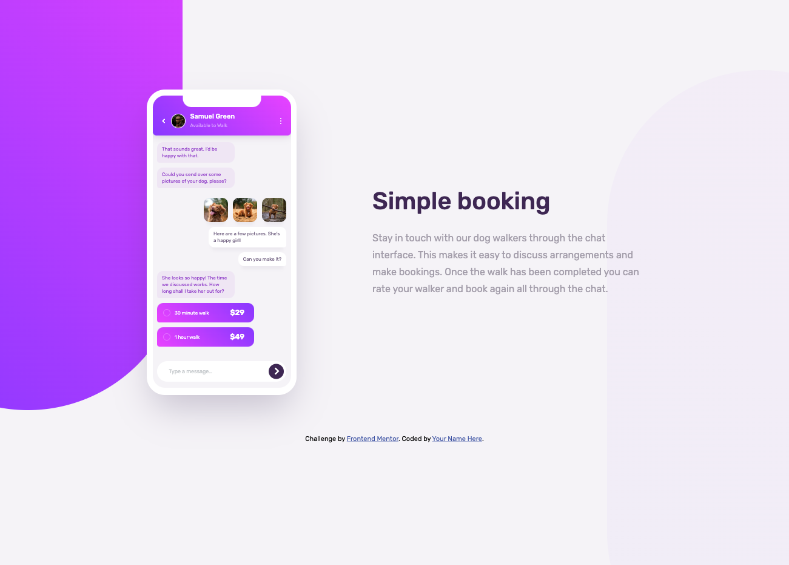

# Frontend Mentor - Chat app CSS illustration solution

This is a solution to the [Chat app CSS illustration challenge on Frontend Mentor](https://www.frontendmentor.io/challenges/chat-app-css-illustration-O5auMkFqY). Frontend Mentor challenges help you improve your coding skills by building realistic projects.

## Table of contents

- [Overview](#overview)
  - [The challenge](#the-challenge)
  - [Screenshot](#screenshot)
  - [Links](#links)
- [My process](#my-process)
  - [Built with](#built-with)
- [Author](#author)

**Note: Delete this note and update the table of contents based on what sections you keep.**

## Overview

### The challenge

Users should be able to:

- See hover and focus states for all interactive elements on the page

### Screenshot

### Links

- Solution URL: [github.com/ClaytonDewey/fem-chat-app-css-illustration](https://github.com/ClaytonDewey/fem-chat-app-css-illustration)
- Live Site URL: [claytondewey.github.io/fem-chat-app-css-illustration](https://claytondewey.github.io/fem-chat-app-css-illustration/)

## My process

### Built with

- Accessibility
- Semantic HTML5 markup
- CSS custom properties
- Flexbox
- Mobile-first workflow

## Author

- Website - [Clayton Dewey](https://www.claytondewey.com)
- Frontend Mentor - [@ClaytonDewey](https://www.frontendmentor.io/profile/ClaytonDewey)
- Twitter - [@ClaytonDewey](https://www.twitter.com/ClaytonDewey)
